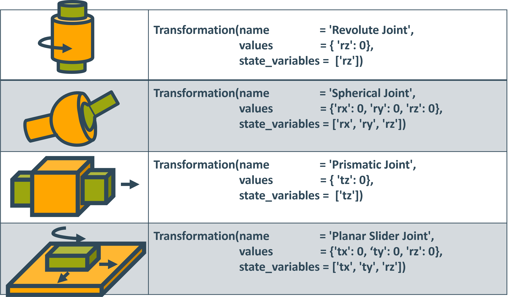

# Summary

The domain of robotics has long been dominated by either serial manipulator arms or parallel robots.
However, with the advent of 3D printing more and more combinations of both can be seen.
These hybrid chains have excellent stiffness, payload to weight ratio, and a decent workspace \cite{survey}.
The price to be paid for these improvements is modeling complexity.
Finding an explicit solution for the inverse or forward kinematics is often not possible and has to be solved as a constrained optimization problem.
Most of the established robotics modeling software’s are out of the box not possible to perform these calculations. #TODO citation needed

TriP is a python package designed to close this gap using a modular modeling framework akin to the one proposed by #TODO cite appropriate paper.
It allows the modeling of arbitrary kinematic topologies and is capable of calculating their forward and inverse kinematics.
It does so using a symbolic framework that makes it easy to implement custom case-dependent mathematical solvers.

# Statement of need

While a huge number of researchers use hybrid robots #TODO cite researchers (and robots?)
most robotics frameworks only support kinematic calculations for open chains. #TODO cite such frameworks and say "frameworks such as..."
This requires developers to either shoehorn their robots into such a framework # TODO cite example
or are left to implement their kinematic calculations from scratch.

Especially during rapid prototyping, both can be tedious and time-consuming.  #TODO example of hybrid legs for cheap quadrupeds?
TriP is designed to simplify this process by directly modeling hybrid systems and calculating their kinematics.

# Overview

TriP models robots using the Robot class.
A Robot object is made up of Transformation and KinematicGroup objects. The KinematicGroup objects are used to model parallel-kinematics while the Transformation objects model serial kinematic. See figure \ref{hybrid_chain_taxonomy_groups} for reference.

Transformations can be specified using different conventions, currently roll, pitch, and yaw angles, as well as quaternions, are supported. #TODO cite both
Transformations can be either dynamic or static with dynamic transformations implementing joints.
A few examples can be seen in figure \ref{sample_trafo}.

Groups use the decomposition approach described in #TODO cite appropriate paper
Here the parallel kinematic is treated as serial manipulator whose joint state can be mapped to the true joint state of the parallel manipulator.

For an example of a excavator with two hydraulic cylinders this results in two groups. Both can be seen in figure \ref{group_structure}
where one is green and the other one is blue.

The figure also demonstrates the mappings, the virtual chain treats the excavator as if his hinges are directly actuated.
The groups also contain a mapping that map the hinge state onto the state of the hydraulic cylinder.
In this case such a mapping can be trigonometric, however using casadi #TODO cite casadi
it is also possible to solve the closure equation of the parallel manipulator.

Both groups and transfromations can be connected to form transformation trees, this is done by specifying the parent child relationship on initialization.

To solve the inverse kinematics for a given end-effector, TriP can generate a symbolic representation using casadi #TODO cite casadi
This symbolic representation can be used to set up a solver object that then solves the inverse kinematics.
While the library already implements a simple inverse kinematics solver the symbolic representation makes it easy to implement custom solvers.

All features of TriP are thoroughly documented with tutorials and examples to help people get started.

# References
