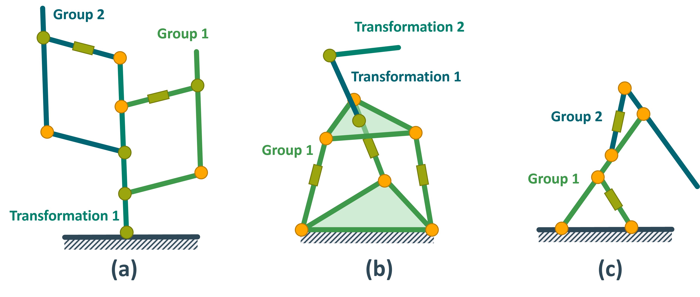
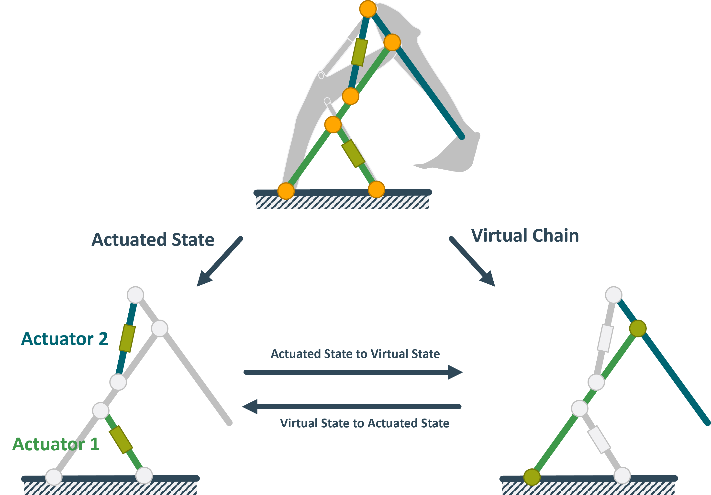

# Summary

​Robots can be classified according to their mechanical structure.
Serial mechanisms like robotic arms are mechanisms where each moving part (called a link) is connected to only the one before and after it.
They are often used when a large workspace is required, meaning the robot needs a long reach.
In parallel mechanisms, the links of the robot form loops causing them to be structurally stronger and stiffer.

If both a large workspace and structural strength are required, hybrids between serial and parallel mechanisms are used.
These mechanisms contain both serial and parallel mechanisms.
While hybrid mechanisms combine the mechanical advantages of both parallel and serial mechanisms they also combine their modeling disadvantages.

​Finding an explicit solution for either forward or inverse kinematics is often impossible.
Using numerical approaches instead leads to complicated constrained optimization problems. ​

While serial mechanisms are very well supported by current robotic frameworks, parallel mechanisms and hybrid mechanisms especially are often not supported at all.
A great overview of the supported robot types for different robotic frameworks was compiled by @kumar .

​TriP is a python package designed to close this gap using a modular modeling framework akin to the one described by ​@survey​ .
​It allows the modeling of arbitrary hybrid mechanisms and is capable of calculating forward and inverse kinematics.

The calculations are performed using a symbolic framework.
This makes it easy for users to implement custom case-dependent mathematical solvers.

# Statement of Need
While a huge number of researchers use hybrid serial parallel systems such as @PISLA, @verne or @berkley , most modern kinematics frameworks still lack support.

Instead robotics frameworks only support serial or branching manipulators.
Examples include openrave (@openrave ) used in in the moveit stack (@moveit )  or the matlab robotics toolbox (@matlabrobot ).
​This often leaves developers with essentially two choices:

Either shoehorn their hybrid robots into a framework not designed to handle them or be left to implement their own kinematic solvers.
In both cases common practices can be observed which are reimplemented each time.
These are reported by @survey .

​TriP is a lightweight and easy-to-use package directly modeling hybrid mechanisms and calculating their kinematics.
​It is primarily aimed at researchers and engineers who quickly want to build kinematic models in order to test their mechanical designs.

# Overview

​TriP models robots using its Robot class.
​A Robot object is made up of Transformation and KinematicGroup objects. The KinematicGroup objects are used to model parallel mechanisms while the Transformation objects model serial mechanisms. See Figure ​\ref{hybrid_chain_taxonomy_groups} for reference. Here the links of each robot are colored according to the group or transformation it belongs to.

Voth groups and transformations can be connected to form branching mechanisms as indicated in Figure \ref{hybrid_chain_taxonomy_groups} .

​Transformations can be either dynamic or static with dynamic transformations implementing joints.
​A few example joints can be seen in Figure ​​\ref{sample_trafo} .

While all example joints use Euler angles in roll pitch yaw convention for rotation, quaternions are also supported.

​Groups model parallel mechanisms using the abstraction approach described by  ​@survey​ .
​It models a parallel manipulator as a virtual serial manipulator whose virtual joint state can be mapped to the true actuated joint state of the parallel manipulator.

An illustrative example of this model is an excavator with two hydraulic cylinders.
Each cylinder is part of a parallel mechanism resulting in two groups. Both can be seen in Figure \ref{group_structure}
​where one is green and the other one is blue.

The abstraction approach models the excavator as an serial manipulator where the joints are directly actuated.
Using two mappings to convert the state of the hydraulic cylinders to the state of the joints and vise versa it is possible to calculate both forward and inverse kinematics.
​In this example, the mapping between cylinders and joints can be expressed using trigonometry.
Since an explicit formulation of the mappings might not always be possible TriP can also compute the mapping by solving the closure equation of the parallel manipulator.

TriP can generate symbolic representations of robots using casadi (​@casadi ).
​This symbolic representation can be used to set up a solver object that then solves the inverse kinematics.
​While the library already implements a simple inverse kinematics solver the symbolic representation makes it easy to implement custom solvers.

​All features of TriP are thoroughly documented with tutorials and examples to help people get started.

# References